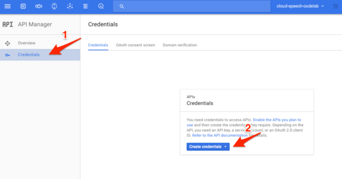
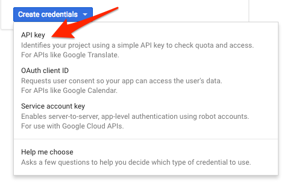

# google_translator

[](https://pub.dev/packages/google_translator)

**A flutter plugin for adapting screen and font size.Let your UI display a reasonable layout on different screen sizes!**

## Usage:

### Get the Google Translation Api key:
- First you will need to start a project in [Google Cloud Platform](https://console.cloud.google.com/)

- Then Enable **Google Cloud Translation API**
  

- Create a credentials key for your account..

  Navigate to the API Manager section of your project dashboard,
  

  In the drop down menu, select **API key**:
  

### Add dependency：
Please check the latest version before installation.
If there is any problem with the new version, please use the previous version
```yaml
dependencies:
  # Functionalities
  google_translator: ^{latest version}
  ..
  flutter:
    sdk: flutter
```
### Add the following imports to your Dart code:
```dart
import 'package:google_translator/google_translator.dart';
```

## Getting Started
First, you will need to send the API Key, allong with a few default parameters described bellow, before the calling of the translate function (we recomend to do as in the example):
```dart
void main() {
    /// Required to make the `GoogleTranslatorInit` call before the `MaterialApp`
    WidgetsFlutterBinding.ensureInitialized();
    runApp(MyApp());
}

class MyApp extends StatelessWidget {

  final String apiKey = "YOUR_GCP_API_KEY";

  @override
  Widget build(BuildContext context) {
    return GoogleTranslatorInit(apiKey,
      translateFrom: Locale('pt-br'),
      translateTo: Locale('en'),
      // automaticDetection: , In case you don't know the user language will want to traslate,
      // cacheDuration: Duration(days: 13), The duration of the cache translation.
      builder: () => MaterialApp(
        title: 'Flutter Demo',
        theme: ThemeData(
          primarySwatch: Colors.blue,
        ),
        home: MyHomePage(title: 'Página inicial de demonstração do Flutter'),
      ),
    );
  }
}
```
*Note*: If will want to make the call before the MaterialApp, will have to add the *WidgetsFlutterBinding.ensureInitialized();* before the *runApp* function.
______________
## Basic Usage

Now, all you'll have to make is add the *.translate()* to all the *Text* you want to translate.

```dart
Scaffold(
    appBar: AppBar(
    title: Text(widget.title ?? "").translate(),
    ),
    body: Column(
        children: [
            Text("Meu texto traduzido").translate(),
            Text("Este texto mostra um placeholder diferente").translate("Place to Holder")
        ]
    ),
);
```

## Todo:
- [ ] Add extension to `RichText`;
- [ ] Add extension to `CupertinoTextField`;
- [ ] Add extension to `CupertinoSearchTextField`;
- [ ] Add extension to `CupertinoSearchTextField`;
- [ ] Add extension to `TextField`;
- [ ] Add extension to `Tooltip`;
- [x] Add extension to `SelectableText`.
- [ ] Migrate `dio_http_cache` dependency to a safer one (expecting creators to add null-safety on https://pub.dev/)

## Disclaimer

This package works with cache data [dio_http_cache](https://pub.dev/packages/dio_http_cache), that, by default last's 7 days, but can be change in the `GoogleTranslatorInit` > `cacheDuration` parameter.

## Issues

Please if you see any issues, bugs, or feature requests, send to me in: [GitHub issue](https://github.com/JulioCGMC/google_translator/issues).